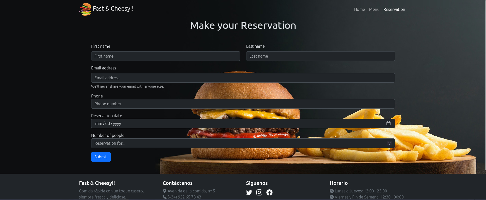

# Fast & Cheesy

  

## Content
- [Description](#description)
- [Link](#link)

## Description
This is a restaurant website for "Fast & Cheesy!!" created using **HTML**, **CSS**, and **Bootstrap**. It features a menu with food items, prices, and images, along with a reservation form. The design is responsive, with a dark color scheme and a footer containing contact info, hours, and social media links.

## Link
Here you have the link to my project: [Fast & Cheesy](https://chugani05.github.io/fast-cheesy/)
